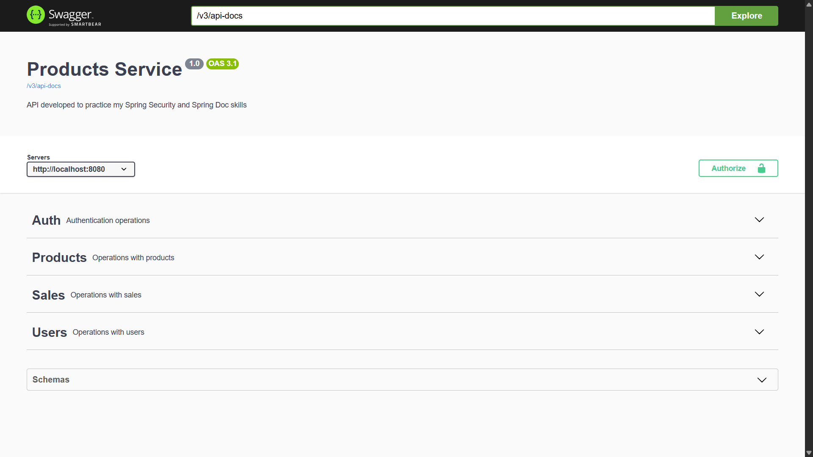

# Products Service

> API Restful desenvolvida a fim de pôr em prática os meus conhecimentos em Spring Security com Autenticação JWT.

## 📋 Índice

- [Funcionalidades](#-funcionalidades)
- [Tecnologias Utilizadas](#-tecnologias-utilizadas)
- [Banco de dados](#-banco-de-dados)
- [Documentação](#-documentação-da-api)
- [Exemplos de uso](#-exemplos-de-uso)
- [Como Rodar a Aplicação](#-como-rodar-a-aplicação)
- [Testes](#-testes)
- [Testando a API com Swagger](#-testando-a-api-com-swagger)
- [Testando a API com Postman](#-testando-a-api-com-postman)

## ⚙️ Funcionalidades

* ✅ **Sistema de Autenticação e Autorização Robusto**: Implementado com **Spring Security** e **JWT** para controle de acesso baseado em roles.
    - Hierarquia de Roles: As roles seguem uma hierarquia de privilégios: `ADMIN` $\rightarrow$ `MANAGER` $\rightarrow$ `CUSTOMER`. Um usuário com uma role superior herda todas as permissões das roles inferiores.

* 👥 Gerenciamento de Usuários:
    - Registro Público: Qualquer pessoa pode se registrar. Usuários são cadastrados com a role padrão: `CUSTOMER`.
    - Autenticação de Usuários: Usuários já registrados podem autenticar-se via login.
    - Criação por ADMIN: Usuários com a role `ADMIN` podem criar novos usuários com a role desejada (`CUSTOMER`, `MANAGER` ou `ADMIN`).
    - Listagem de Usuários: Acesso restrito a usuários com role mínima `MANAGER`.

* 💰 Gerenciamento de Vendas:
    - Cadastro de Vendas: Apenas usuários com a role `ADMIN` têm permissão para cadastrar vendas.
    - Listagem de Vendas:
        - Todas as Vendas: Usuários com role mínima de `MANAGER` podem listar todas as vendas do sistema.
        - Minhas vendas: Qualquer usuário autenticado (`CUSTOMER`, `MANAGER`, `ADMIN`) pode listar suas próprias vendas.
    - Detalhes de Vendas:
        - Detalhes de Qualquer Venda: Usuários com as roles `ADMIN` ou `MANAGER` podem visualizar os detalhes de qualquer venda.
        - Detalhes das Próprias Vendas: Qualquer usuário autenticado (`CUSTOMER`, `MANAGER`, `ADMIN`) pode consultar os detalhes de suas próprias vendas.

> 🔐 Usuário padrão: Ao inicializar a aplicação é adicionado um usuário ADMIN padrão com:
> - Login: admin
> - Senha: admin

## 💻 Tecnologias Utilizadas

- **Spring Boot** – Framework principal para criação da API REST.
- **Spring Security** – Implementação da autenticação e autorização com JWT.
- **Spring Doc** - Utilizado para documentar a API.
- **Testcontainers** – Utilizado para testes de integração com instâncias reais do banco de dados MySQL em container.
- **Spring Data JPA** – Integração com banco de dados usando repositórios e consultas com JPA.
- **Hibernate** – Implementação ORM (mapeamento objeto-relacional) apenas para a validação do Schema.
- **MySQL** – Banco de dados relacional utilizado na aplicação.
- **Docker** – Containerização do banco de dados.
- **Maven** – Gerenciador de dependências e automação de build.

## 💾 Banco de Dados

### 📐 Estrutura do Banco
- Abaixo está o diagrama que representa a estrutura do banco de dados utilizada no projeto:

<div style="text-align: center;">
  
</div>

## 📄 SQL
- A aplicação, ao inicializar, configura o banco de dados através do arquivo sql, presente em `src/main/resources/sql/schema.sql`.
- Esse script realiza a criação das tabelas e insere as roles padrão na tabela `role`, sendo elas:
  - `ADMIN`
  - `CUSTOMER`
  - `MANAGER`


## 📚 Documentação da API

A API possui documentação completa, exibida via **Swagger UI**, permitindo a visualização e teste de todas as rotas disponíveis.

🔗 Acesse em: `http://localhost:8080/swagger-ui/index.html`

<div style="text-align: center;">
    
</div>

## 🧪 Exemplos de Uso

### Autenticação (Público)

**Requisição:**
```http
POST /api/v1/auth/login
Content-Type: application/json

{
  "login": "admin",
  "password": "admin"
}
```

**Resposta Esperada:**
```
{
  "token": "eyJhbGciOiJIUzI1NiIsInR5cCI6Ikp..."
}
```

Obs: o token é meramente ilustrativo

### Registro de Usuário (Público)

**Requisição:**
```http
POST /api/v1/auth/register
Content-Type: application/json

{
  "firstName": "Marcus",
  "lastName": "Branches",
  "login": "marcus.branches",
  "password": "senhaSegura123"
}
```

**Resposta Esperada:**
```http
HTTP/1.1 201 Created
```

### Criação de Usuário (ADMIN)

**Requisição:**
```http
POST /api/v1/users
Authorization: Bearer {seu-token-ADMIN}
Content-Type: application/json

{
    "firstName": "Michael",
    "lastName": "Souza",
    "login": "manager",
    "password": "Senh@Muit0S3gur4_",
    "roles": [
        "MANAGER"
    ]
}
```

**Resposta Esperada:**
```http
{
    "id": "f7f46b8d-28ec-41a3-a885-bdd7a6a3aec0",
    "firstName": "Michael",
    "lastName": "Souza",
    "login": "manager",
    "encryptedPassword": "$2a$10$gPFpnoiKPmxGLuo2LqW8oeFygTP//dLzZX2qjKWvgzqwHIa8EqyJy",
    "roles": [
        {
            "role": "MANAGER",
            "description": "has limited access to administrative and management functionalities"
        }
    ]
}
```

### Listagem de Usuários (MANAGER / ADMIN)

**Requisição:**
```http
GET /api/v1/users
Authorization: Bearer {seu-token-MANAGER-OU-ADMIN}
```

**Resposta Esperada:**
```http
[
  {
    "id": "a1b2c3d4-e5f6-7890-1234-567890abcdef",
    "firstName": "admin",
    "lastName": "admin",
    "login": "admin",
    "encryptedPassword": "$2a$10$gPFpnoiKPmxGLuo2LqW8oeFygTP//dLzZX2qjKWvgzqwHIa8EqyJy",
    "roles": [
      {
        "role": "ADMIN",
        "description": "has all system accesses"
      }
    ]
  },
  {
    "id": "f7f46b8d-28ec-41a3-a885-bdd7a6a3aec0",
    "firstName":  "Mário",
    "lastName": "Silva",
    "login": "manager",
    "encryptedPassword": "$2a$10$gPFpnoiKPmxGLuo2LqW8oeFygTP//dLzZX2qjKWvgzqwHIa8EqyJy",
    "roles": [
      {
        "role": "MANAGER",
        "description": "has limited access to administrative and management functionalities"
      }
    ]
  }
```

### Cadastro de Produto (ADMIN)

**Requisição:**
```http
POST /api/v1/products
Authorization: Bearer {seu-token-ADMIN}
Content-Type: application/json

{
  "name": "Monitor UltraWide LG",
  "unitPrice": 1800.00
}
```

**Resposta Esperada:**
```http
{
  "id": 1,
  "name": "Monitor UltraWide LG",
  "unitPrice": 1800.00
}
```

### Listagem de Produtos (Qualquer Usuário Autenticado)

**Requisição:**
```http
GET /api/v1/products
Authorization: Bearer {seu-token-QUALQUER-AUTENTICADO}
```

**Resposta Esperada:**
```http
[
  {
    "id": 1,
    "name": "Monitor UltraWide LG",
    "unitPrice": 1800.00
  },
  {
    "id": 2,
    "name": "Teclado Mecânico HyperX",
    "unitPrice": 450.00
  },
  {
    "id": 3,
    "name": "Mouse Gamer Logitech",
    "unitPrice": 250.00
  }
]
```

### Cadastro de Vendas (Qualquer Usuário Autenticado)

**Requisição:**
```http
POST /api/v1/sales
Authorization: Bearer {seu-token-QUALQUER-AUTENTICADO}
Content-Type: application/json

{
  "products": [
    {
      "productId": 1,
      "quantity": 5
    },
    {
      "productId": 2,
      "quantity": 2
    }
  ]
}
```

**Resposta Esperada:**
```http
{
  "id": 1,
  "customer": {
    "id": "a1b2c3d4-e5f6-7890-1234-567890abcdef",
    "firstName": "Marcus",
    "lastName": "Branches"
  },
  "products": [
    {
      "name": "Monitor UltraWide LG",
      "unitPrice": 1800.00,
      "quantity": 5,
      "totalValue": 9000.00
    },
    {
      "name": "Teclado Mecânico HyperX",
      "unitPrice": 450.00,
      "quantity": 2,
      "totalValue": 900.00
    }
  ],
  "totalValue": 9900.00
}
```

### Listagem de Vendas (ADMIN - Todas as Vendas)

**Requisição:**
```http
GET /api/v1/sales
Authorization: Bearer {seu-token-ADMIN}
```

**Resposta Esperada:**
```http
[
  {
    "id": 1,
    "customer": {
      "id": "a1b2c3d4-e5f6-7890-1234-567890abcdef",
      "firstName": "Marcus", 
      "lastName": "Branches"
    },
    "totalValue": 9900.00
  },
  {
    "id": 2,
    "customer": {
      "id": "b1c2d3e4-f5a6-7890-1234-567890abcdef",
      "firstName": "Lucas",
      "lastName": "Prado"
    },
    "totalValue": 250.00
  }
]
```

### Listagem de Vendas (Usuário Autenticado - Minhas Vendas)

**Requisição:**
```http
GET /api/v1/sales/me
Authorization: Bearer {seu-token-AUTENTICADO}
```

**Resposta Esperada:**
```http
[
  {
    "id": 2,
    "customer": {
      "id": "b1c2d3e4-f5a6-7890-1234-567890abcdef",
      "firstName": "Lucas",
      "lastName": "Prado"
    },
    "totalValue": 250.00
  }
]
```

### Detalhes de Venda (ADMIN / MANAGER - Qualquer Venda)

**Requisição:**
```http
GET /api/v1/sales/1/details
Authorization: Bearer {seu-token-ADMIN-OU-MANAGER}
```

**Resposta Esperada:**
```http
{
  "id": 1,
  "customer": {
    "id": "a1b2c3d4-e5f6-7890-1234-567890abcdef",
    "firstName": "Marcus",
    "lastName": "Branches"
  },
  "products": [
    {
      "name": "Monitor UltraWide LG",
      "unitPrice": 1800.00,
      "quantity": 5,
      "totalValue": 9000.00
    },
    {
      "name": "Teclado Mecânico HyperX",
      "unitPrice": 450.00,
      "quantity": 2,
      "totalValue": 900.00
    }
  ],
  "totalValue": 9900.00
}
```

### Detalhes de Venda (Usuário Autenticado - Compra Específica)

**Requisição:**
```http
GET /api/v1/sales/me/2/details
Authorization: Bearer {seu-token-CUSTOMER-OU-MANAGER}
```

**Resposta Esperada:**
```http
{
  "id": 2,
  "customer": {
    "id": "b1c2d3e4-f5a6-7890-1234-567890abcdef",
    "firstName": "Lucas",
    "lastName": "Prado"
  },
  "products": [
    {
      "name": "Mouse Gamer Logitech",
      "unitPrice": 250.00,
      "quantity": 1,
      "totalValue": 250.00
    }
  ],
  "totalValue": 250.00
}
```

## 🚀 Como Rodar a Aplicação

### Requisitos
- Git
- Docker 
- Maven
- Java 21

### 1. Clone o projeto
- Para clonar o projeto e acessar o diretório na sua máquina, execute:
```
git clone https://github.com/mbranches/products-service.git
cd products-service
```

### 2. Popule as variáveis de ambiente
- Variáveis Docker
   - Renomeie o arquivo da raíz do repositório `.envTemplate` para `.env` e preencha a variável com o valor desejado para o seu ambiente de desenvolvimento.
   ```env
    MYSQL_ROOT_PASSWORD=suasenha
- Variáveis Spring Boot
   - Navegue até o diretório `src/main/resources`.
   - Renomeie o arquivo `.envTemplate` para `.env`.
   - Configure `ENV_MYSQL_PASSWORD` igual o definido no `.env` da raíz do projeto.
   - Adicione sua secret key à `ENV_JWT_SECRET_KEY`.
   ```env
    MYSQL_ROOT_PASSWORD=suasenha
    ENV_JWT_SECRET_KEY=sua-secret-key
  ```

### 3. Execute o container
- Para executar o container com o Banco de Dados MySQL, rode o seguinte comando:
```
docker-compose up -d
```

### 4. Rodar a API
- Para executar a aplicação com o maven, execute:
```
mvn spring-boot:run
```

## 🧪 Testes

A aplicação possui cobertura com **testes unitários** e **testes de integração**, garantindo o correto funcionamento dos componentes e fluxos principais. Utilizamos **Testcontainers** para prover um ambiente real com MySQL durante os testes de integração.

### 🧩 Testes Unitários

- Testa isoladamente cada classe da camada de serviço;
- Uso de **mocks com Mockito** para simular dependências e garantir teste de lógica pura.
- Garantem que regras de negócio funcionem corretamente sem necessidade de infraestrutura.

---

### 🌐 Testes de Integração

- Testam os **fluxos completos da aplicação**, do controller ao banco de dados.
- Utilizam **MockMvc** e **Testcontainers (MySQL)** para garantir comportamento realista.
- Incluem autenticação, controle de acesso, persistência, e resposta das APIs.

---

### ▶️ Como Executar os Testes

Execute todos os testes com:

```
mvn test
```

## ✅ Testando a API com Swagger

1. **Acessando a Documentação**
   - Com a API rodando, vá até a url `http://localhost:8080/swagger-ui/index.html`

2. **Autenticação**
   - Vá até a seção `Auth`
   - Realize a autenticação utilizando o endpoint /login com suas credenciais válidas (login e senha).
   - O token JWT será retornado na resposta.

3. **Configuração do Token JWT**
   - Clique no botão "Authorize" no topo da interface.
   - No campo "value", insira seu token JWT retornado no momento do login, e clique em "Authorize".

4. **Explorando os Endpoint**
   - Os endpoints estão organizados por categorias como auth, products, sales e users.
   - Clique em cada categoria para visualizar os métodos disponíveis (GET, POST, etc.).
   - Clique em "Try it out" para testar e preencha os campos de entrada (caso necessário).

## 📂 Testando a API com Postman

> É necessário ter o Postman instalado, caso não tenha você pode baixá-lo gratuitamente no [site oficial](https://www.postman.com/downloads/)

1. **Baixar o Arquivo da Collection**:  
   Na pasta `data` do repositório, você encontrará um arquivo chamado `Product_Service.postman_collection`. Esse arquivo contém todas as rotas da API, prontas para serem usadas no **Postman**.

2. **Importar a Collection**:
   - Abra o **Postman**.
   - Clique em **Import** no canto superior esquerdo da tela.
   - Selecione o arquivo `Product_Service.postman_collection` que você baixou da pasta `data`.
   - Após a importação, todas as rotas estarão disponíveis no **Postman**.

3. **Consumindo a API**:  
    - Dentro da Collection, vá até a pasta **Auth** e execute a requisição de **Login** para se autenticar.
    - Um **script automático** irá armazenar o token JWT retornado em uma **variável de ambiente** chamada: `accessToken`
   - Todas as requisições protegidas já estão configuradas para usar essa variável no cabeçalho e prontas para serem testadas